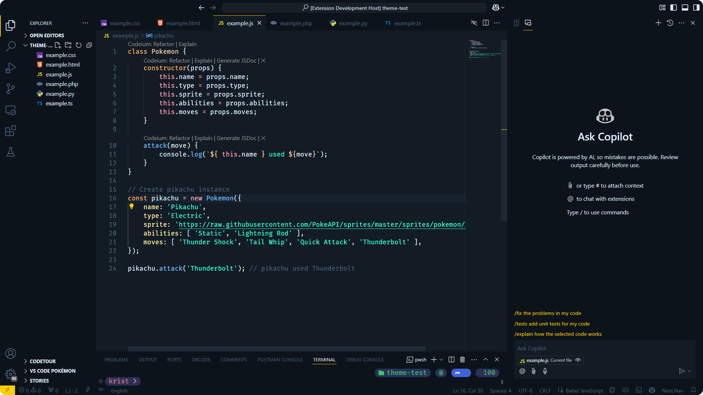
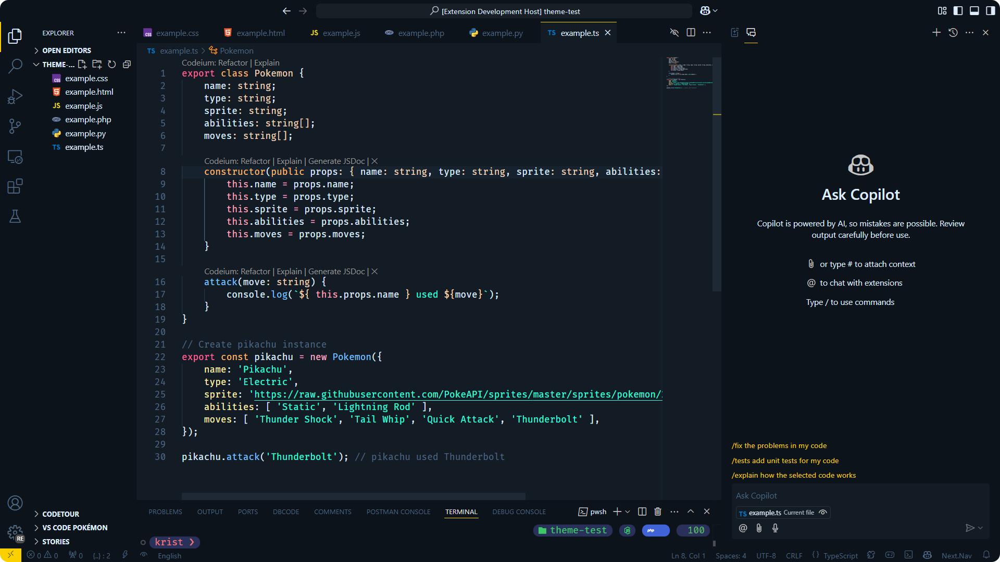
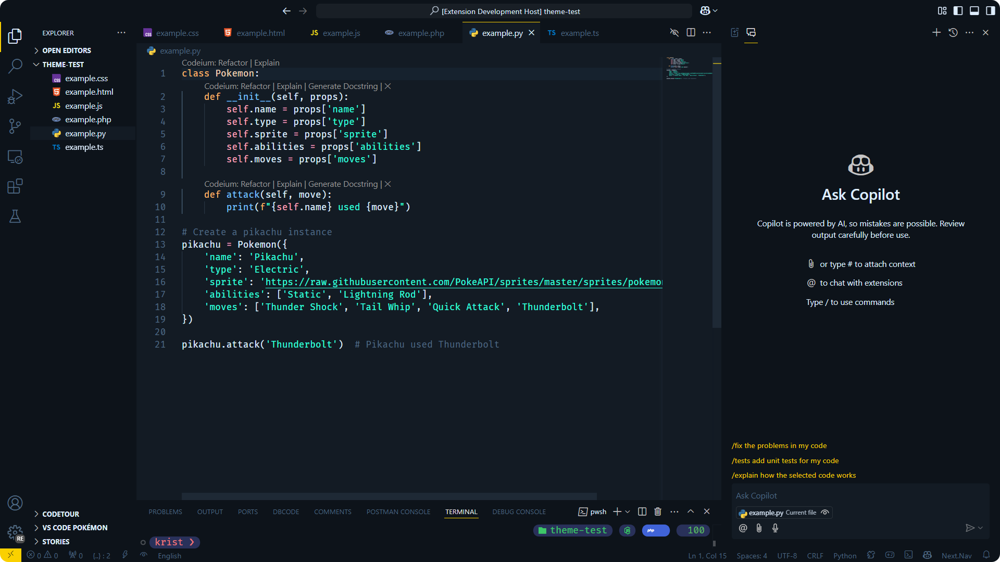

<h3 align="center">
     
    Pikachu Theme for <a href="https://code.visualstudio.com">VSCode</a>
</h3>

    
    
    

A Visual Studio Code theme inspired by the iconic color palette of Pikachu, the beloved and recognizable mascot of the Pokémon franchise. This theme combines vibrant yellow tones to create a unique and energizing visual experience for developers.

Designed for those seeking a more personalized and nostalgic programming environment, it prioritizes code readability, ensuring that syntactic elements such as keywords, strings, comments, and variables stand out clearly and harmoniously.

Originally, this theme was published by [milab](https://github.com/mIaborde) a few years ago, though I’m unsure why the project was removed. I’ve always been very fond of this theme, so I decided to republish it so other users can enjoy it in Visual Studio Code. Additionally, I’m committed to maintaining it and improving it over time, always respecting the original work and giving proper credit to its author.

## 📸 Previews

    
HTML

    

    
CSS

    

    
JavaScript

    

    
TypeScript

    

    
PHP

    

    
Python

    

## 📦 Install

1. Open the extensions sidebar on Visual Studio Code.
   
2. Search for `Pikachu Theme VsCode` and install it.
   
3. Go to Color Themes settings and choose `Pikachu` as the color theme or `CMD + Shift + P` and enter Command `> color theme` and choose `Pikachu`.

## 🙏 Credits

Thanks to [milab](https://github.com/mIaborde) for the original work.

&nbsp;

    

